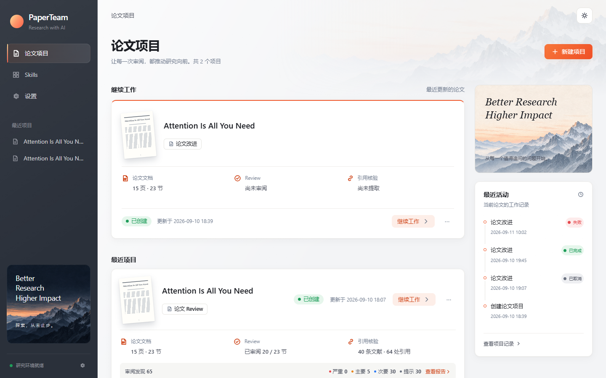
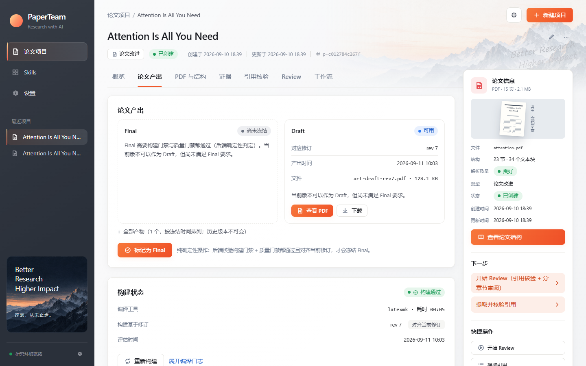
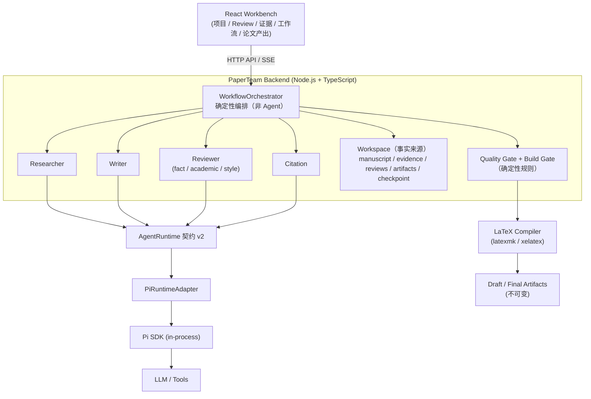
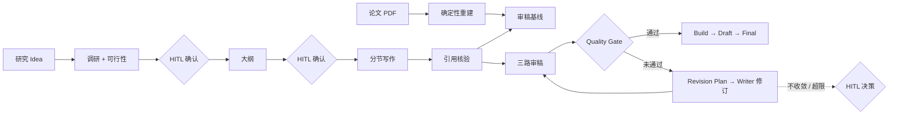

# PaperTeam

**AI-native multi-agent academic research & paper review workbench** —
从研究 Idea 到论文交付、以及已有论文系统性改进的 AI 多 Agent 学术研究与论文生产工作台。

```text
Idea → Research → Feasibility → Evidence → Writing → Review / Revision Loop → Quality Gate → LaTeX / PDF
```



## 这是什么

PaperTeam 用**少量专业 Agent + 确定性编排**完成学术论文的生产与审阅闭环：

- **Idea-to-Paper**：输入研究想法，Researcher 完成调研与可行性评估（不承诺达不到的目标），经人工确认后进入大纲、分节写作、引用核验、审稿-修订闭环，最终产出 LaTeX / PDF（Draft / Final 双产物语义）。
- **Existing Paper — Quick Review**：导入论文 PDF，只读分析——引用真实性核验（Crossref / OpenAlex / arXiv）→ 论断-引用语义一致性 → 分章节审阅 → 可导出报告；不修改论文。
- **Existing Paper — Improvement**：PDF 确定性重建为可修订稿件 → 审稿基线 → 改进计划（人工确认）→ Writer 逐节修订 → 质量门禁 → Draft / Final。

三条主路径共享同一套质量基础设施：**多 Agent 工作流（HITL / 取消 / 断点恢复）、引用完整性、Evidence 工作台、确定性 Quality Gate、不可变版本链（历史 / 比较 / 恢复）**。

## 核心能力

| 能力 | 说明 |
| --- | --- |
| 多 Agent 工作流 | Researcher / Writer / Reviewer / Citation 四角色 + 确定性 TypeScript WorkflowOrchestrator（流程控制不交给 LLM）；Stage DoD 校验、checkpoint 断点恢复、SSE 实时进度、协作式取消 |
| HITL 人工决策 | 可行性确认 / 大纲确认 / 改进计划确认 / 修订不收敛或超限时的人工决策（approve / adjust / revise / accept_draft / cancel），随 checkpoint 持久化，浏览器刷新与后端重启后可恢复 |
| 引用完整性 | Layer 1 真实性核验（外部学术库，NOT_FOUND ≠ 捏造 ≠ 检索失败）；Layer 2 论断-引用语义核验（原子论断 × 引用组、judge 禁止凭记忆、伪造引文剥离），可按 run 配置关闭 |
| 长论文审阅 | PDF 解析 → PaperMap 导航图 + 受控分章节上下文（其他章节全文绝不进入当前审阅上下文），有界并发 + 背压 |
| 审稿-修订闭环 | Reviewer 三路并行审稿 → 确定性聚合 → Quality Gate → 确定性 Revision Plan → Writer 逐节修订 → 强制复审 → 收敛判定（PASS / IMPROVED / CONVERGED / REGRESSION，纯代码） |
| 质量门禁 | 13+ 条确定性规则（学术评分 / 引用完整性 / 可行性），结论可解释（ruleId → 中文说明 → 深链处理入口），轮次隔离，修订后过期如实提示 |
| Draft / Final | Build Gate（LaTeX 真实编译）通过即冻结 Draft；Final 要求双 Gate 通过且对齐当前修订；产物不可变、可查看 / 下载；编译失败自动修复 ≤2 次 |
| 版本体验 | 论文修订的不可变版本链：版本历史（修订号 / 来源 / 审稿轮次 / 门禁结论 / 产物）、两修订确定性比较（章节级差异 + 记分对照，零 LLM）、恢复历史版本（= 创建新修订，历史与旧 Final 永不删除） |



## 架构





## Quick Start

已在 **Windows 11 + Node 22/24/25** 上完整验证；Linux/macOS 未做系统验证（依赖均为跨平台 npm 包，理论可用）。

```bash
git clone https://github.com/JiahongXu88/PaperTeam.git
cd PaperTeam
npm run install:all   # backend（Pi SDK 0.84.4 精确 pin）+ frontend（React 19 + Vite）+ e2e（Playwright）
npm run doctor        # 环境自检：Node / 依赖 / PDF 解析工具链（Python 3.10+ 与 pymupdf）
npm run dev           # 一键启动：Backend :3000 + React Workbench :5173（/api 同源代理）
```

浏览器打开 **http://localhost:5173** —— 项目列表 / 新建项目（从想法开始 或 导入已有论文 PDF）。

### 配置模型（Agent 调用必需）

推荐在 **Settings → 模型设置** 页面选择 Provider / Model 并保存 API Key（Key 只经同源
Backend 保存到 `~/.paperteam`，不进仓库、任何接口不回显）；也可用环境变量
（`PAPERTEAM_PI_MODEL` / `PAPERTEAM_PI_API_KEY`，见 [.env.example](.env.example)）。
支持 Anthropic / OpenAI 兼容网关与自定义 Provider（三种协议、额外请求头、模型目录）。
不配置模型时应用正常启动（Agent 调用返回结构化失败，不伪造成功）。

### 依赖说明

| 依赖 | 用途 | 何时需要 |
| --- | --- | --- |
| Python 3.10+ 与 `pymupdf` | PDF 解析（`backend/tools/parse_paper_pdf.py` 子进程，stdout JSON 协议） | 导入已有论文（三条路径的 PDF 输入） |
| MiKTeX / TeX Live（`latexmk` + `xelatex`） | LaTeX 编译 | Idea-to-Paper 与系统性改进产出 Draft / Final；**Quick Review 不需要** |

`npm run doctor` 会给出缺失项与安装命令；PDF 解析缺失时导入返回
`503 PDF_PARSER_UNAVAILABLE`（附安装命令），不是 `spawn ENOENT`。

### 测试与 E2E

```bash
npm run build          # backend tsc + frontend 构建
npm run typecheck      # 前后端类型检查
npm test               # backend + frontend 全部 vitest（不需要模型 / 外网）

# 浏览器级 E2E（Playwright，本机 Chrome；需 dev 栈或 scripted 测试栈已启动）
cd e2e && npm test     # 各套件按环境门控自动跳过；scripted 栈与门控变量见各 spec 文件头注释
```

测试策略：编排引擎与业务服务为真实实现，仅 AgentRuntime 注入脚本化实现
（`PAPERTEAM_TEST_RUNTIME=scripted`——Workflow / checkpoint / SSE / HTTP / React /
LaTeX 编译全真实，只有模型输出是确定性脚本）；另有真实模型 smoke 记录在各里程碑。

## 当前状态：M4 MVP（Alpha）

M1–M4 已完成（Runtime 迁移到 Pi in-process、React 工作台、三条产品路径、
质量基础设施与版本体验）；真实模型 / 真实 MiKTeX 的端到端验证记录见
[docs/PROJECT_STATUS.md](docs/PROJECT_STATUS.md)。定位是 **MVP / Alpha**，不是
Production Stable 1.0。

### Known Limitations（真实清单）

- **Visual Reviewer 未实现**：审阅基于文本层（PDF 图表 / 版式不在审稿上下文内）。
- **Skill install / update 未实现**：Skill Registry 为仓库内审计 seed（两项 MIT skill，
  pin revision），无在线安装 / 更新。
- **后端进程崩溃时进行中的模型调用无法迁移**：workflow 从 checkpoint 恢复
  （已成功 stage 不重跑），但当次未完成的 Agent 调用会以失败重试。
- **Windows 下 LaTeX 编译超时只终止 shell 进程**（`shell:true` 的已知遗留）。
- **PDF 重建是文本级**：系统性改进的重建稿不含原图 / 原版式，公式以转义文本呈现
  （Writer 修订在此基础上逐节重写）。
- **单机单用户形态**：无鉴权 / 多租户；Docker 部署与系统管理后台未实现。
- **分页与规模**：项目 / run 列表无分页；EvidenceStore 为 JSONL 全量读写
  （几十个修订 / 数百条 Evidence 规模内验证）。

## 技术栈

| 层 | 技术 |
| --- | --- |
| Frontend | React 19 + TypeScript + Vite（React Router 7 + TanStack Query 5 + Zustand 5）；手写 CSS Design Tokens，浅色 / 深色 / 跟随系统 |
| Backend | Node.js + TypeScript（原生 HTTP，无 Web 框架） |
| Agent Runtime | Pi SDK（`@earendil-works/pi-coding-agent`，in-process，M3.8 起唯一 Runtime） |
| Workflow | PaperTeam WorkflowOrchestrator（确定性 TypeScript 编排引擎） |
| PDF 解析 | Python 3 + pymupdf（子进程 JSON 协议，不是 Python backend） |
| E2E | Playwright（`e2e/`，本机 Chrome；scripted 测试栈） |

## 文档

| 文档 | 说明 |
| --- | --- |
| [docs/PRD.md](docs/PRD.md) | 产品需求文档 |
| [docs/PROJECT_STATUS.md](docs/PROJECT_STATUS.md) | 项目当前状态与里程碑记录（M1–M4） |
| [docs/ARCHITECTURE.md](docs/ARCHITECTURE.md) | 系统架构（含架构红线：事实来源 / 会话 / 事件 / 双 Gate） |
| [docs/API_CONTRACT.md](docs/API_CONTRACT.md) | Frontend API Contract（端点 / DTO / SSE / 变更纪律） |
| [docs/DECISIONS.md](docs/DECISIONS.md) | 技术决策记录（ADR，D-0001~D-0029） |

## 目录结构

```text
PaperTeam/
├── package.json         # 根开发入口（dev / doctor / build / typecheck / test）
├── scripts/dev.mjs      # dev 启动器（Node/依赖检查 → 构建 → 同时启动 Backend + Vite）
├── scripts/doctor.mjs   # 环境自检（Node / 依赖 / Python + pymupdf）
├── frontend/            # React Web Workbench（React 19 + Vite）
├── backend/             # PaperTeam Backend（API / Workflow / Pi Runtime / LaTeX / 版本域）
│   └── tools/parse_paper_pdf.py   # PDF 解析工具（pymupdf 子进程，stdout JSON 协议）
├── e2e/                 # Playwright 浏览器级 E2E（仅测试工具，不进产品代码）
└── docs/                # 项目文档（PRD / 架构 / API Contract / ADR / 状态）
```

## Runtime 说明

- **Pi in-process**：`@earendil-works/pi-coding-agent` **0.84.4** 精确 pin；业务层只面向
  `AgentRuntime` 契约 v2（`startAgent` → 句柄：事件流 / 取消 / result），Pi SDK import
  限制在 Runtime 适配层。
- **角色映射**：Researcher / Writer / Reviewer / Citation 无 agent 注册表概念，角色
  （systemPrompt + 工具白名单）由适配层按 contextScope 前缀解析；会话维度
  `projectId × agentId × contextScope`（如 Reviewer 三路审稿三个独立会话并行互不污染）。
- **历史**：OpenClaw（2026.8→2026.9.1）为 M3.5/M3.6 的历史 Runtime 基线；M3.8 正式
  迁移到 Pi 并移除全部 OpenClaw 运行时依赖（git 历史即回退机制）。
