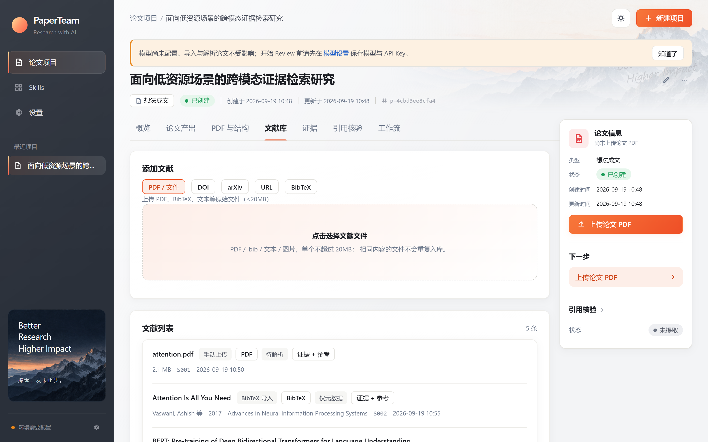
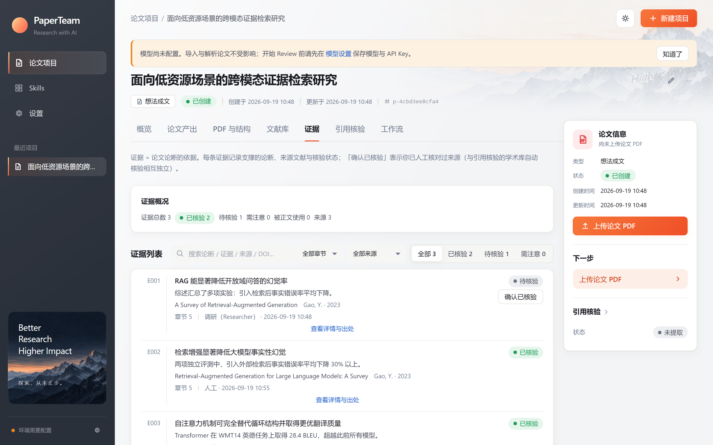
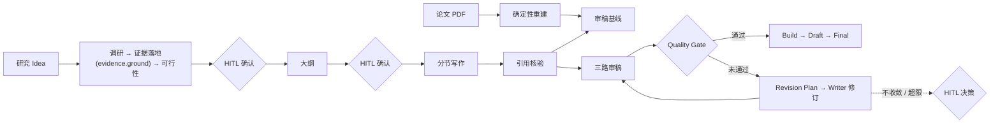

# PaperTeam

**Evidence-grounded scientific agent system for academic research & paper
production** — 少量专业 Agent + 确定性编排：多源检索（Retrieval）→ 证据接地
（Evidence Grounding，**Retrieved ≠ Verified ≠ Grounded**）→ 写作 / 审阅 →
修订安全（Revision Safety）→ 确定性质量门禁，全链路有可靠性评估；覆盖从研究
Idea 到论文交付、以及已有论文系统性改进。

```text
Idea → Research → Evidence Grounding → Feasibility → Writing → Review / Revision Loop → Quality Gate → LaTeX / PDF
```


## 这是什么

PaperTeam 用**少量专业 Agent + 确定性编排**完成学术论文的生产与审阅闭环：

- **Idea-to-Paper**：输入研究想法，Researcher 完成调研 → 证据落地（evidence.ground）→ 可行性评估（不承诺达不到的目标），经人工确认后进入大纲、分节写作、引用核验、审稿-修订闭环，最终产出 LaTeX / PDF（Draft / Final 双产物语义）。
- **Existing Paper — Quick Review**：导入论文 PDF，只读分析——引用真实性核验（Crossref / OpenAlex / arXiv）→ 论断-引用语义一致性 → 分章节审阅 → 可导出报告；不修改论文。
- **Existing Paper — Improvement**：PDF 确定性重建为可修订稿件 → 审稿基线 → 改进计划（人工确认）→ Writer 逐节修订 → 质量门禁 → Draft / Final。

三条主路径共享同一套质量基础设施：**多 Agent 工作流（HITL / 取消 / 断点恢复）、文献库与混合检索、证据接地（Retrieved ≠ Verified ≠ Grounded）、引用完整性、Evidence 工作台、确定性 Quality Gate、不可变版本链（历史 / 比较 / 恢复）**。

## 工作流程（用户视角）

以 Idea-to-Paper 为主线（导入已有论文的审阅 / 改造路径共享同一套质量基础设施）：

```text
研究目标（用户的研究 Idea）
  → Researcher 多源检索发现来源（学术库 + Web；检索默认零持久化，显式保存才入库）
  → 证据接地：候选证据三段核验，只有 verified 证据可用
  → Writer 基于已验证证据生成稿件
  → Reviewer 三路审稿 → 确定性 Revision Plan
  → Writer 逐节修订 + revision.validate 复核
  → Quality Gate 确定性门禁 → Build Gate（LaTeX 编译）→ Draft / Final
```

可行性 / 大纲 / 修订不收敛等决策点由人工确认（HITL，随 checkpoint 持久化）；
每一步产物都在工作台对应标签页可查（文献库 / 证据 / Review / 工作流 / 论文产出）。

## 核心能力

| 能力 | 说明 |
| --- | --- |
| 多 Agent 工作流 | Researcher / Writer / Reviewer / Citation 四角色 + 确定性 TypeScript WorkflowOrchestrator（流程控制不交给 LLM）；Stage DoD 校验、checkpoint 断点恢复、SSE 实时进度、协作式取消 |
| HITL 人工决策 | 可行性确认 / 大纲确认 / 改进计划确认 / 修订不收敛或超限时的人工决策（approve / adjust / revise / accept_draft / cancel），随 checkpoint 持久化，浏览器刷新与后端重启后可恢复 |
| 引用完整性 | Layer 1 真实性核验（外部学术库，NOT_FOUND ≠ 捏造 ≠ 检索失败）；Layer 2 论断-引用语义核验（原子论断 × 引用组、judge 禁止凭记忆、伪造引文剥离），可按 run 配置关闭 |
| 研究发现（M6.3） | 多源学术检索（OpenAlex / Semantic Scholar / arXiv / AMiner）+ 可选 SearXNG Web 搜索；共享 ProviderHttpClient（超时 / 退避 / Retry-After / 熔断 / 健康四态）；检索默认零持久化，显式保存为候选 |
| 文献库（M6.2） | 五种入库（PDF 上传 / DOI / arXiv / URL / BibTeX）；SourceIdentity 分层身份键精确判等；候选 ≠ 正式文献（promotion 幂等）；条目级 metadata 可信分层 merge；Evidence 引用阻止删除 |
| 项目检索 RAG（M6.4） | 确定性 SourceChunk 管线 + 进程内 BM25 + 可选 dense + RRF 混合检索 + Context Budget Packing；`retrieve_library` 工具；零 Vector DB / 零外部索引引擎（Index 为 Derived State，可删可重建） |
| 证据接地（M6.5/M6.6） | EvidenceCandidate 候选-转正状态机 + 三段核验（quote 逐字 / metadata 权威记录 / 语义 judge，前两段确定性）；**Retrieved ≠ Verified ≠ Grounded**——写作 / 审稿消费侧只认 verified 证据（writer formalOnly 视图、citations_evidence_backed Gate 规则），Agent 只能提案、不能定义什么是证据 |
| 修订安全（M6.7） | RevisionPlanItem 生命周期状态机 + revision.validate 四类确定性复核（Fact / Citation Preservation、Claim Strength 升级检测、Evidence 复核）+ Claim Strength Gate（强 claim 弱证据拦截）+ hitl.revision_validation（reject = 恢复修订前快照） |
| 可靠性评估（M6.8/M6.9） | scripted 离线确定性评估 + 五模型族 live 评估（GLM-5.3 / claude-fable-5-1 / gpt-5.4 / deepseek-v4-pro / qwen3.7-max）：Plain LLM 25/25 提案捏造引用，PaperTeam 管线零捏造证据泄漏（evaluated scenarios 内，限制如实见报告）；评估只读被测系统 |
| 长论文审阅 | PDF 解析 → PaperMap 导航图 + 受控分章节上下文（其他章节全文绝不进入当前审阅上下文），有界并发 + 背压；Runtime 层另有全局并发上限 + 有界等待队列 + 上下文预算（超限回转/拒绝，绝不静默截断）+ 会话 TTL/GC（Workflow 局部并发与 Runtime 全局治理两层） |
| 审稿-修订闭环 | Reviewer 三路并行审稿 → 确定性聚合 → Quality Gate → 确定性 Revision Plan → Writer 逐节修订 → 强制复审 → 收敛判定（PASS / IMPROVED / CONVERGED / REGRESSION，纯代码） |
| 质量门禁 | 13+ 条确定性规则（学术评分 / 引用完整性 / 可行性），结论可解释（ruleId → 中文说明 → 深链处理入口），轮次隔离，修订后过期如实提示 |
| 事实 / 引用保持 | 确定性双 Gate：Citation Preservation（修订不得无依据丢失引用）+ Fact Preservation（表格数值 / 正文数字 / 公式 / 方向结论 / 协议不得无依据改写，负结果不得美化；授权只认计划 + Evidence；篡改稿拒绝冻结 Draft） |
| Per-Agent 模型配置 | Writer / Researcher / Academic / Fact / Style / Citation 六个业务 Agent 可独立指定 provider / model（缺省继承全局默认；凭据按 provider 共用，不重复存 Key；运行记录按 Agent × 模型归因 token / cost） |
| 外部意见驱动修订 | 期刊专家 / 编辑 / 导师 / 本人修改意见手工录入（原文逐字保存），作为最高**业务**优先级（mandatory）进入修订计划；supports reviewer-driven revision with conflict detection and deterministic preservation gates——与实验事实冲突时如实标记并给出依据，不伪造、不篡改、不静默忽略；处理状态（已处理 / 部分处理 / 未处理 / 冲突）为确定性判定，不采信模型自称 |
| Draft / Final | Build Gate（LaTeX 真实编译）通过即冻结 Draft；Final 要求双 Gate 通过且对齐当前修订；产物不可变、可查看 / 下载；编译失败自动修复 ≤2 次 |
| 版本体验 | 论文修订的不可变版本链：版本历史（修订号 / 来源 / 审稿轮次 / 门禁结论 / 产物）、两修订确定性比较（章节级差异 + 记分对照，零 LLM）、恢复历史版本（= 创建新修订，历史与旧 Final 永不删除） |






## 架构

```mermaid
flowchart TD
    UI["React Workbench<br/>(项目 / 文献库 / 证据 / Review / 工作流 / 论文产出)"] -->|HTTP API / SSE| ORCH
    subgraph Backend["PaperTeam Backend (Node.js + TypeScript)"]
        ORCH["WorkflowOrchestrator<br/>确定性编排（非 Agent）"]
        SRC["Research Discovery<br/>(M6.3: OpenAlex / Semantic Scholar /<br/>arXiv / AMiner + SearXNG)"]
        LIB["Literature Library + Hybrid Retrieval<br/>(M6.2/M6.4: SourceIdentity 身份键、<br/>BM25 + RRF，零 Vector DB)"]
        EVD["Evidence Grounding<br/>(M6.5: 候选-转正状态机 + 三段核验，<br/>Retrieved ≠ Verified ≠ Grounded)"]
        ORCH --> RES["Researcher"]
        ORCH --> WRI["Writer"]
        ORCH --> REV["Reviewer<br/>(fact / academic / style)"]
        ORCH --> CIT["Citation"]
        WS["Workspace（事实来源）<br/>manuscript / sources / evidence / reviews / artifacts / checkpoint"]
        GATE["Quality Gate + Build Gate<br/>（确定性规则）"]
    end
    ORCH --> SRC
    SRC --> LIB
    LIB --> EVD
    EVD -.verified 才进正式上下文.-> WRI
    RES & WRI & REV & CIT --> RT["AgentRuntime 契约 v2"]
    RT --> PI["PiRuntimeAdapter"]
    PI --> SDK["Pi SDK (in-process)"]
    SDK --> LLM["LLM / Tools"]
    ORCH --> WS
    ORCH --> GATE
    GATE --> LATEX["LaTeX Compiler<br/>(xelatex + bibtex)"]
    LATEX --> ART["Draft / Final Artifacts<br/>(不可变)"]
```





## Quick Start

已在 **Windows 11 + Node 22/24/25** 上完整验证；Linux/macOS 未做系统验证（依赖均为跨平台 npm 包，理论可用）。

```bash
git clone https://github.com/JiahongXu88/PaperTeam.git
cd PaperTeam
npm run install:all   # backend（Pi SDK 0.84.4 精确 pin）+ frontend（React 19 + Vite）
npm run doctor        # 环境自检：Node / 依赖 / PDF 解析工具链（Python 3.10+ 与 pymupdf）/ Git
npm run dev           # 一键启动：Backend :3000 + React Workbench :5173（/api 同源代理）
```

浏览器打开 **http://localhost:5173** —— 项目列表 / 新建项目（从想法开始 或 导入已有论文 PDF）。

### 配置模型（Agent 调用必需）

推荐在 **Settings → 模型设置** 页面选择 Provider / Model 并保存 API Key（Key 只经同源
Backend 保存到 `~/.paperteam`，不进仓库、任何接口不回显）；也可用环境变量
（`PAPERTEAM_PI_MODEL` / `PAPERTEAM_PI_API_KEY`，见 [.env.example](.env.example)）。
支持 Anthropic / OpenAI 兼容网关与自定义 Provider（三种协议、额外请求头、模型目录）。
不配置模型时应用正常启动（Agent 调用返回结构化失败，不伪造成功）。

### 依赖说明

| 依赖 | 用途 | 何时需要 |
| --- | --- | --- |
| Python 3.10+ 与 `pymupdf` | PDF 解析（`backend/tools/parse_paper_pdf.py` 子进程，stdout JSON 协议） | 导入已有论文（三条路径的 PDF 输入） |
| MiKTeX / TeX Live（`xelatex` + `bibtex`） | LaTeX 编译（M9.5.1 起显式编排，不依赖 latexmk/perl） | Idea-to-Paper 与系统性改进产出 Draft / Final；**Quick Review 不需要** |

`npm run doctor` 会给出缺失项与安装命令；PDF 解析缺失时导入返回
`503 PDF_PARSER_UNAVAILABLE`（附安装命令），不是 `spawn ENOENT`。

### 测试与 E2E

```bash
npm run build          # backend tsc + frontend 构建
npm run typecheck      # 前后端类型检查
npm test               # backend + frontend 全部 vitest（不需要模型 / 外网）

# 浏览器级 E2E（Playwright，本机 Chrome；需 dev 栈或 scripted 测试栈已启动）
cd e2e && npm install && npm test   # 各套件按环境门控自动跳过；scripted 栈与门控变量见各 spec 文件头注释
```

测试策略：编排引擎与业务服务为真实实现，仅 AgentRuntime 注入脚本化实现
（`PAPERTEAM_TEST_RUNTIME=scripted`——Workflow / checkpoint / SSE / HTTP / React /
LaTeX 编译全真实，只有模型输出是确定性脚本）；另有真实模型 smoke 记录在各里程碑。

## 当前状态：M6 COMPLETE（M1–M6）

M1–M4 已完成（Runtime 迁移到 Pi in-process、React 工作台、三条产品路径、
质量基础设施与版本体验）。M5（中文论文质量与长程运行可靠性）已于 2026-09-16
全部收口：M5.1/M5.2 Runtime 生命周期可靠性与长程运行治理（分层超时 / 全局并发
与有界受理 / context budget / 会话 rotation / TTL·GC·容量 / 观测面与安全自愈）；
M5.3 受控学术 Skill 接入；M5.4 中文学术风格修订回路；M5.5 单机 Linux / Docker
部署（2026-09-15 真实 Docker 验收，见 [docs/DEPLOYMENT.md](docs/DEPLOYMENT.md)）；
M5.6 真实论文 A/B 验收——**Citation Preservation** 与 **Fact Preservation**
双层确定性 Gate 上线并被真实模型运行验证（Skill 质量增益未获稳定证据，如实记录，
见 [docs/M5_ACCEPTANCE.md](docs/M5_ACCEPTANCE.md)）；M5.7 最终产品化——per-Agent
provider/model 配置与外部专家 / 导师意见驱动的修订（见下方功能清单）。

**M6（Research Discovery & Evidence-grounded Pipeline）已于 2026-09-18 全部完成
并冻结（M6.0–M6.9，Documentation Freeze，D-0041）**：M6.2 Literature Library →
M6.3 Research Discovery & Academic/Web Search → M6.4 Project RAG & Hybrid
Retrieval → M6.5 Evidence Grounding → M6.6 Evidence-aware Writing Loop →
M6.7 Revision Safety → M6.8/M6.9 Agent Reliability Evaluation（scripted 离线
与五模型族 live）。M6 全程**零新增 Agent**（能力以 Tool 层 + Evidence Layer +
Quality Gate 交付，D-0009 红线）；核心不变量 **Retrieved ≠ Verified ≠
Grounded**（详见 [docs/ARCHITECTURE.md](docs/ARCHITECTURE.md) §1.3）。M7.0
产品化基线已收口（前端对齐 M6 能力：项目「文献库」标签页、侧边栏响应式修复、
论文导入流程增强；不新增 Agent / Runtime / Workflow）。

**M8（Controlled Deep Research Loop）已于 2026-09-22 全部完成**：研究从
一次性即时检索升级为「计划 → 批准 → 执行 → 覆盖 → 缺口分析 → HITL →
派生 → 受控多轮循环」——Research Plan 一等产物（M8.1）、Plan Execution
真实学术检索与执行审计（M8.2）、Iteration 单一派生（M8.3.1）、Coverage
Analyzer（M8.3.2）、Research Gap + HITL + Loop Policy（M8.3.3）、受控多轮
Executor（三处 HITL 断点 + 策略停止 + 崩溃恢复按磁盘事实重算，M8.4）、
Pipeline Hardening（CandidateStore 并发安全 / 损坏显式报错 / 执行审计
字段，M8.5）。全程零新增 Agent；**Retrieved ≠ Candidate ≠ Literature ≠
Verified Evidence 不变量保持**（loop 不自动保存候选 / 不 promote / 不写
Evidence）。真实模型 + 真实学术检索验收见
[docs/research/M8_DEEP_RESEARCH_VALIDATION_REPORT.md](docs/research/M8_DEEP_RESEARCH_VALIDATION_REPORT.md)；
Post-M8 市场对齐审计与后续路线（M9 = Full Paper E2E Activation）见
[docs/research/POST_M8_MARKET_ALIGNED_ROADMAP.md](docs/research/POST_M8_MARKET_ALIGNED_ROADMAP.md)。

**里程碑总览见
[docs/research/M6_FINAL_SUMMARY.md](docs/research/M6_FINAL_SUMMARY.md)；整体
状态与真实模型 / 真实 MiKTeX 的端到端验证记录见
[docs/PROJECT_STATUS.md](docs/PROJECT_STATUS.md)。**定位是 **MVP / Alpha**，不是
Production Stable 1.0。

### Known Limitations（真实清单）

- **Visual Reviewer 未实现**：审阅基于文本层（PDF 图表 / 版式不在审稿上下文内）。
- **Skill 只能从仓库内 approved catalog 安装 / 更新**（有意为之）：五项 MIT skill
  均为审计 seed + 固定上游 commit；没有任意 URL 安装、没有 marketplace；Skill
  「已注入」不等于「已被 Agent 读取」（accessed 只按真实 read 事件记录）。
- **后端进程崩溃时进行中的模型调用无法迁移**：workflow 从 checkpoint 恢复
  （已成功 stage 不重跑），但当次未完成的 Agent 调用会以失败重试。
- **Windows 下 LaTeX 编译超时只终止 shell 进程**（`shell:true` 的已知遗留）。
- **PDF 重建是文本级**：系统性改进的重建稿不含原图 / 原版式，公式以转义文本呈现
  （Writer 修订在此基础上逐节重写）。
- **单机单用户形态**：无鉴权 / 多租户；系统管理后台未实现（Docker 部署已于 M5.5 交付并通过真实验收，见上文）。
- **分页与规模**：项目 / run 列表无分页；EvidenceStore 为 JSONL 全量读写
  （几十个修订 / 数百条 Evidence 规模内验证）。

## Docker 部署（单机单用户，M5.5）

```bash
cp .env.example .env        # 可选：模型 Key；缺失也能启动，UI 中配置
docker compose build && docker compose up -d
curl -fsS http://localhost:8080/ready
```

web（nginx，唯一对外端口 8080）+ backend（Node 22 + Pi SDK + Python/pymupdf +
XeLaTeX/bibtex + 中文字体，不对外发布）；数据在 `paperteam-projects` /
`paperteam-runtime` 两个 volume。细节、依赖审计与验收清单见 [docs/DEPLOYMENT.md](docs/DEPLOYMENT.md)。

## 技术栈

| 层 | 技术 |
| --- | --- |
| Frontend | React 19 + TypeScript + Vite（React Router 7 + TanStack Query 5 + Zustand 5）；手写 CSS Design Tokens，浅色 / 深色 / 跟随系统 |
| Backend | Node.js + TypeScript（原生 HTTP，无 Web 框架） |
| Agent Runtime | Pi SDK（`@earendil-works/pi-coding-agent`，in-process，M3.8 起唯一 Runtime） |
| Workflow | PaperTeam WorkflowOrchestrator（确定性 TypeScript 编排引擎） |
| PDF 解析 | Python 3 + pymupdf（子进程 JSON 协议，不是 Python backend） |
| E2E | Playwright（`e2e/`，本机 Chrome；scripted 测试栈） |

## 文档

| 文档 | 说明 |
| --- | --- |
| [docs/PRD.md](docs/PRD.md) | 产品需求文档 |
| [docs/PROJECT_STATUS.md](docs/PROJECT_STATUS.md) | 项目当前状态与里程碑记录（M1–M6） |
| [docs/research/M6_FINAL_SUMMARY.md](docs/research/M6_FINAL_SUMMARY.md) | M6 里程碑总览（Research Discovery & Evidence-grounded Pipeline，冻结 D-0041） |
| [docs/research/M6.8_EVALUATION_REPORT.md](docs/research/M6.8_EVALUATION_REPORT.md) | M6.8 scripted 离线评估报告（三实验 / 故障注入 / 指标） |
| [docs/M5_ACCEPTANCE.md](docs/M5_ACCEPTANCE.md) | M5 真实论文 A/B 验收记录（环境 / 指标 / 修复 / 最终判定） |
| [docs/RELEASE_NOTES_M5.md](docs/RELEASE_NOTES_M5.md) | M5 Release Notes（COMPLETE；未打 tag——本语料 Final 无法达成） |
| [docs/DEPLOYMENT.md](docs/DEPLOYMENT.md) | 单机 Linux / Docker 部署（依赖审计 / 持久化 / 密钥 / 验收清单） |
| [docs/ARCHITECTURE.md](docs/ARCHITECTURE.md) | 系统架构（含 M6 冻结架构 §1.3 与架构红线：事实来源 / 会话 / 事件 / 双 Gate） |
| [docs/API_CONTRACT.md](docs/API_CONTRACT.md) | Frontend API Contract（端点 / DTO / SSE / 变更纪律） |
| [docs/DECISIONS.md](docs/DECISIONS.md) | 技术决策记录（ADR，D-0001~D-0041） |

## 目录结构

```text
PaperTeam/
├── package.json         # 根开发入口（dev / doctor / build / typecheck / test）
├── scripts/dev.mjs      # dev 启动器（Node/依赖检查 → 构建 → 同时启动 Backend + Vite）
├── scripts/doctor.mjs   # 环境自检（Node / 依赖 / Python + pymupdf）
├── frontend/            # React Web Workbench（React 19 + Vite）
├── backend/             # PaperTeam Backend（API / Workflow / Pi Runtime / LaTeX / 版本域）
│   └── tools/parse_paper_pdf.py   # PDF 解析工具（pymupdf 子进程，stdout JSON 协议）
├── e2e/                 # Playwright 浏览器级 E2E（仅测试工具，不进产品代码）
├── evaluation/          # M6.8/M6.9 Agent 可靠性评估（scripted 框架 + live，报告在 evaluation/reports/）
└── docs/                # 项目文档（PRD / 架构 / API Contract / ADR / 状态）
```

## Runtime 说明

- **Pi in-process**：`@earendil-works/pi-coding-agent` **0.84.4** 精确 pin；业务层只面向
  `AgentRuntime` 契约 v2（`startAgent` → 句柄：事件流 / 取消 / result），Pi SDK import
  限制在 Runtime 适配层。
- **角色映射**：Researcher / Writer / Reviewer / Citation 无 agent 注册表概念，角色
  （systemPrompt + 工具白名单）由适配层按 contextScope 前缀解析；会话维度
  `projectId × agentId × contextScope`（如 Reviewer 三路审稿三个独立会话并行互不污染）。
- **历史**：OpenClaw（2026.8→2026.9.1）为 M3.5/M3.6 的历史 Runtime 基线；M3.8 正式
  迁移到 Pi 并移除全部 OpenClaw 运行时依赖（git 历史即回退机制）。
