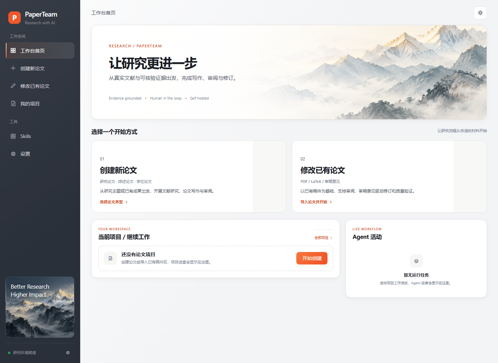
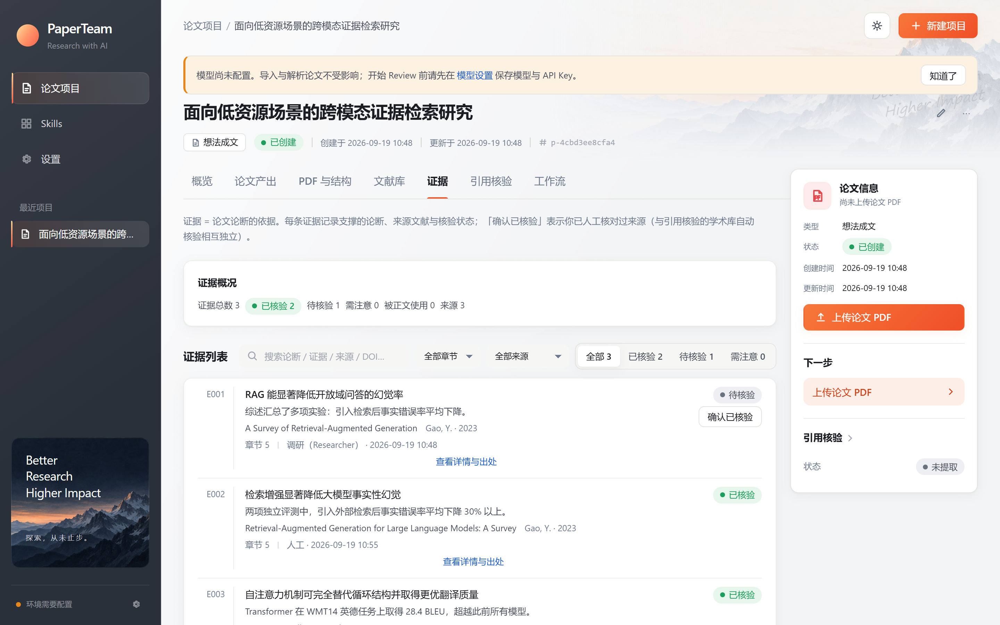
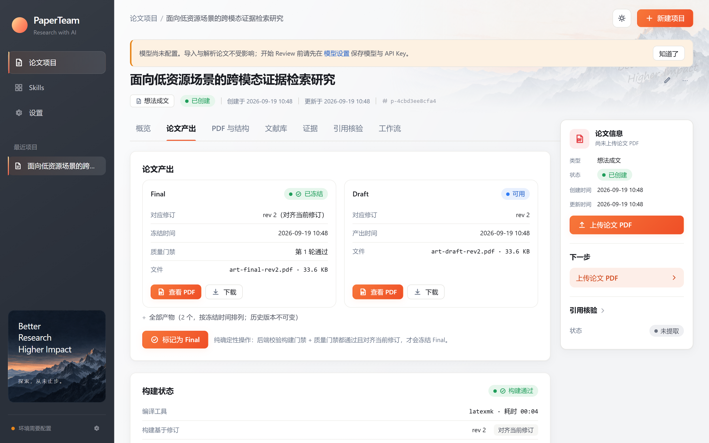
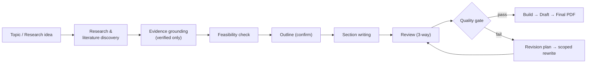
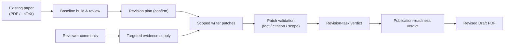

# PaperTeam

[](https://github.com/JiahongXu88/PaperTeam/actions/workflows/ci.yml)
[](LICENSE)

**PaperTeam is a self-hosted AI workbench for academic writing.** It searches real
literature, grounds claims in verified evidence, drafts and reviews papers, compiles
them to LaTeX/PDF — and when you already have a manuscript and reviewer comments, it
revises the manuscript comment by comment without breaking your facts or citations,
and tells you honestly when a decision belongs to you.

[查看中文文档（README.zh-CN）](README.zh-CN.md)



## What you can do with it

### 1. Write a paper from a topic or research idea

Pick **Create a new paper**, choose a paper type, and PaperTeam runs the full loop:

- **Survey / review paper** — enter just a topic. PaperTeam plans the research,
  searches and selects literature, prepares full texts, builds a per-paper survey
  matrix and a cross-paper synthesis, waits for you to confirm the outline, then
  writes, reviews, revises, and compiles the survey to PDF. Verified end-to-end on
  real runs with zero fabricated citations.
- **Research article** — enter a research idea. The pipeline adds a feasibility
  assessment: if the target paper needs experiments you don't have, PaperTeam says
  so and produces the **experiment list** (purpose, datasets, baselines, metrics,
  ablations) instead of inventing results. You confirm the plan, then it proceeds
  through outline → section writing → citation verification → review → revision →
  quality gate → Draft/Final PDF.

### 2. Revise an existing paper against reviewer comments

Import your **existing paper** (PDF or a LaTeX project zip), paste reviewer / editor /
advisor comments, and PaperTeam:

1. Rebuilds the manuscript into an editable, section-scoped draft and establishes a
   review baseline (including citation verification against Crossref / OpenAlex / arXiv).
2. Pulls targeted evidence from your own materials for what the reviewers ask for.
3. Plans the revision (you approve the plan), then a scoped Writer applies bounded
   patches — each patch is machine-validated against scope, fact preservation,
   citation preservation, and evidence.
4. Reports per comment: *handled / already satisfied / conflicts with your data /
   needs your decision* — with a separate **publication-readiness** verdict, because
   a completed revision task does not automatically mean the paper is ready to submit.

You can also run a read-only **Quick Review** on any PDF: citation integrity +
section-by-section review, exportable as a report, no changes to your paper.

## Key features

| Area | What it does |
| --- | --- |
| Literature discovery | Multi-source academic search (OpenAlex, Semantic Scholar, arXiv, AMiner; optional SearXNG web search) with shared HTTP resilience; results stay candidates until you promote them |
| Library & retrieval | Five ingestion paths (PDF / DOI / arXiv / URL / BibTeX); deterministic chunking + BM25 + optional dense + RRF hybrid search — no vector database required |
| Evidence grounding | **Retrieved ≠ Verified ≠ Grounded**: candidate evidence passes verbatim-quote, authoritative-metadata, and semantic checks before any writer may cite it |
| Deterministic quality gates | 13+ explainable rules (citation integrity, fact preservation, feasibility, survey contracts); Build Gate (real LaTeX compile) is separate from Quality Gate |
| Revision safety | Scoped patches with immutable snapshots; fact/citation/evidence preservation guards reject unauthorized value changes, claim escalation, and citation loss |
| Human-in-the-loop | 11 decision points (outline, plan, feasibility, revision overflow, …) that pause the run, persist with checkpoints, and survive refresh/restart |
| Model configuration | Per-role model assignment (Writer / Researcher / Reviewers / Planner), built-in and custom providers (3 protocols), Z.AI Coding-Plan vs pay-per-use channels, test-connection |
| Output | Immutable Draft / Final artifacts; xelatex + bibtex explicit orchestration; revision history with compare and restore |
| Observability | Live per-stage progress over SSE, run history, token/cost attribution per agent × model |





## Quick start

Verified on Windows 11 with Node 22/24/25; Linux is covered by CI and the Docker
image (single-user).

```bash
git clone https://github.com/JiahongXu88/PaperTeam.git
cd PaperTeam
npm run install:all   # backend + frontend
npm run doctor        # checks Node, deps, and the PDF toolchain
npm run dev           # backend :3000 + workbench :5173
```

Open <http://localhost:5173>, then configure a model under **Settings → Model
Settings** (provider, model, API key — the key is stored locally under
`~/.paperteam`, never echoed back). Without a model configured the app still runs;
agent calls fail with a structured error instead of pretending to succeed.

Optional dependencies (only when you need them):

| Dependency | Needed for |
| --- | --- |
| Python 3.10+ with `pymupdf` | Importing an existing paper PDF (`pip install "pymupdf>=1.24"`) |
| A LaTeX distribution (`xelatex` + `bibtex`, e.g. MiKTeX / TeX Live) | Compiling Draft/Final PDF output; Quick Review works without it |
| [Docling](https://github.com/docling-project/docling) (optional) | Structured ingestion (layout/tables) of your materials; PyMuPDF fallback otherwise |

Docker (single machine, single user):

```bash
cp .env.example .env    # optional: model key can also be set in the UI
docker compose build && docker compose up -d
curl -fsS http://localhost:8080/ready
```

More details: [docs/getting-started.md](docs/getting-started.md) ·
[docs/deployment (Docker/Linux)](docs/DEPLOYMENT.md) ·
[docs/model-configuration.md](docs/model-configuration.md)

## How it works


```mermaid
flowchart LR
    T["Topic / Research idea"] --> R["Research &<br/>literature discovery"] --> E["Evidence grounding<br/>(verified only)"]
    E --> F["Feasibility check"] --> O["Outline (confirm)"] --> W["Section writing"]
    W --> RV["Review (3-way)"] --> G{"Quality gate"}
    G -->|pass| P["Build → Draft → Final PDF"]
    G -->|fail| V["Revision plan → scoped rewrite"] --> RV
```


```mermaid
flowchart LR
    M["Existing paper<br/>(PDF / LaTeX)"] --> B["Baseline build & review"]
    C["Reviewer comments"] --> S["Targeted evidence supply"]
    B --> PL["Revision plan (confirm)"] --> SW["Scoped writer patches"]
    S --> SW
    SW --> PV["Patch validation<br/>(fact / citation / scope)"]
    PV --> TG["Revision-task verdict"]
    TG --> PR["Publication-readiness verdict"]
    PR --> D["Revised Draft PDF"]
```

The key design choice: **flow control is deterministic TypeScript, not an LLM.** A
small set of specialized agents (Researcher / Writer / Reviewers / Citation) run on
an in-process runtime ([Pi SDK](https://www.npmjs.com/package/@earendil-works/pi-coding-agent)),
while orchestration, validation, and gates are ordinary code you can inspect and
test. See [docs/ARCHITECTURE.md](docs/ARCHITECTURE.md) (in Chinese).

## Research honesty

PaperTeam is built around what it will *not* do:

- **No fabricated experiments.** A research article without real data stops at the
  experiment plan; the feasibility gate blocks Final for unreachable targets until
  you explicitly accept the risk.
- **No fabricated citations.** Only verified evidence enters the writing context;
  references are checked against external bibliographic databases.
- **Revision success ≠ publication ready.** Comment closure, deterministic guards,
  and full-manuscript readiness are reported separately, with author decisions
  surfaced instead of silently resolved.
- **No silent rewriting.** Revisions are scoped patches; unauthorized value changes
  and claim escalations are rejected by code, not by prompt.

## Privacy & data

Self-hosted and local-first: projects, manuscripts, evidence, and artifacts live in
a `projects/` directory on your machine; API keys are stored under `~/.paperteam`
and never written to the repo or returned by any API. There is **no telemetry**.
Your paper leaves the machine only as model API calls to the provider you configure.

## Documentation

| Doc | Contents |
| --- | --- |
| [Getting started](docs/getting-started.md) | Install, prerequisites, first run, troubleshooting |
| [Product guide](docs/product-guide.md) | Using the workbench: projects, tabs, HITL, revisions |
| [Existing-paper revision](docs/existing-paper-revision.md) | Reviewer-comment workflow, revision task vs publication readiness |
| [Evidence & citations](docs/evidence-and-citations.md) | Search → candidate → source → evidence → citation; why Source ≠ Evidence |
| [Model configuration](docs/model-configuration.md) | Providers, per-role models, custom providers, key storage |
| [Architecture](docs/ARCHITECTURE.md) | System design and architecture red lines |
| [Development](docs/development.md) | Dev setup, test layers, repository layout |
| [Deployment](docs/DEPLOYMENT.md) | Docker / single-host Linux deployment |
| [Project status](docs/PROJECT_STATUS.md) | Current engineering status and milestone log |
| [Research reports](docs/research/README.md) | Index of experiment / acceptance / audit reports |
| [API contract](docs/API_CONTRACT.md) | HTTP API / DTO / SSE contract |
| [Decisions](docs/DECISIONS.md) | Architecture decision records |

Docs are written in Chinese; translations are tracked as future work.

## Project status

**Alpha / MVP — active development.** The two core workflows (topic-to-paper and
existing-paper revision) are implemented and validated on real runs: the revision
workflow completed a reliability program of 21 real runs with zero guard false
positives and zero fabricated-content leaks. Deterministic components are covered by
a large vitest suite plus Playwright E2E (scripted agent runtime — no model needed
to run tests).

Current limits, honestly: no visual review of figures/layout; PDF rebuild is
text-level (no original figures); single-user, no auth/multi-tenancy; some actions
remain author decisions by design. Full list in
[docs/PROJECT_STATUS.md](docs/PROJECT_STATUS.md) and
[docs/product-guide.md](docs/product-guide.md).

## Contributing

See [CONTRIBUTING.md](CONTRIBUTING.md). Bug reports and issues are welcome; please
never post real API keys, unpublished manuscripts, or confidential review comments
in issues.

## License

[MIT](LICENSE)
