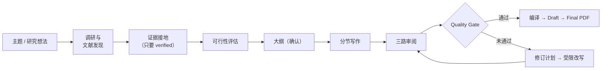
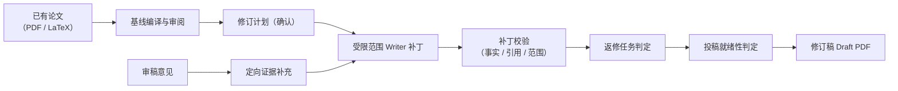

# PaperTeam

[](https://github.com/JiahongXu88/PaperTeam/actions/workflows/ci.yml)
[](LICENSE)

**PaperTeam 是一个自托管的 AI 学术写作工作台。** 它检索真实文献、把论断落在
已核验的证据上、起草并审阅论文、编译 LaTeX/PDF；当你手里已经有一篇稿件和
审稿意见时，它逐条意见地修订稿件——不破坏你的事实与引用，并且如实告诉你
哪些决定属于作者本人。它还能把你的稿件与目标期刊做经验对标、审查图表与
表格（确定性检查 + 可选视觉模型）、并从真实数据集编译出版级矢量图表。

[Read this README in English](README.md)


## 它能帮你做什么

### 场景一：从主题或研究想法写一篇论文

选择「创建新论文」，再选论文类型，PaperTeam 跑完整闭环：

- **综述论文** —— 只输入一个主题。系统制定研究计划、检索并遴选文献、准备
  全文、构建逐篇综述矩阵与跨论文综合，等你确认大纲后继续综述写作、审阅、
  修订，最终编译综述 PDF。已在真实运行中端到端验证，引用零捏造。
- **研究论文** —— 输入研究想法。链路里多一道可行性评估：如果目标论文需要
  你还没有的实验数据，系统会如实说明，并输出**实验清单**（目的 / 数据集 /
  基线 / 指标 / 消融）而不是编造结果。你确认计划后，走 大纲 → 分节写作 →
  引用核验 → 审稿 → 修订 → 质量门禁 → Draft/Final PDF。

### 场景二：按审稿意见修改已有论文

导入**已有论文**（PDF 或 LaTeX 工程压缩包），粘贴期刊外审 / 编辑 / 导师的
修改意见，PaperTeam 会：

1. 把论文重建为可按章节修改的稿件，并建立审稿基线（含 Crossref / OpenAlex /
   arXiv 引用真实性核验）。
2. 针对意见从你自己的材料里定向补充证据。
3. 制定修订计划（你确认后生效），由受限范围的 Writer 逐条打补丁——每个
   补丁都经机器校验：修改范围、事实保持、引用保持、证据支持。
4. 逐条报告意见处理结果：*已处理 / 当前稿已满足 / 与材料冲突 / 需要你决策*，
   并给出独立的**投稿就绪性**判定——因为「返修任务完成」并不等于「论文可投稿」。

你也可以对任意 PDF 跑只读的**快速 Review**：引用完整性 + 分章节审阅，可导出
报告，不改动论文。

### 场景三：把论文对标目标期刊

配置目标画像（论文类型、目标期刊、研究领域），PaperTeam 建立经验参照系：
按投稿目标过滤、按引用数排序的 benchmark 文献发现（真实 OpenAlex 服务端
过滤）→ 自动遴选 8–15 篇参照文献 → 冻结 benchmark / profile / readiness 三个
artifact。你得到六个就绪维度的四档判决（达到 / 部分达到 / 低于目标 / 证据
不足）与来自真实语料分位带——并作为 advisory 上下文进入可行性、审稿人、
Planner 提示词。

诚实边界：这是**对参照语料的质量对标，不是投稿成功保证**。刻意不设数值
「评分」；target 阶段纯 advisory，永不阻断或改变工作流判定；benchmark 文献
按角色隔离，永远不会渗入证据池。

### 场景四：图表与表格的多模态审查

对项目**已登记的视觉资产**——解析 PDF 的图表块、LaTeX 环境、生成图表——
跑一遍视觉审查：六项确定性检查恒跑（label 引用解析 / 重复 label / 缺
caption / 未引用资产 / 表格数值一致性 / caption-引用错配）；配置视觉模型后
再加四项模型辅助检查（图-caption / 图-论断 / 图例-坐标轴 / 方法图-方法
描述一致性）。

诚实边界：审查的是**已支持的视觉资产，不代表任意 PDF 视觉理解**——无法
抽取独立图像资产的 PDF 内嵌图会如实报 skipped，绝不猜测。模型观察永不自动
标 verified，视觉 findings 不进入任何阻断性门禁。

### 场景五：从真实数据编译学术图表

上传数据集（CSV/XLSX/JSON 或已解析来源的表格块），PaperTeam 编译出版级
矢量图表：校验过的 PlotSpec / DiagramSpec → 确定性 pgfplots/TikZ codegen →
单遍 xelatex → 矢量 PDF，内容寻址缓存（同 spec 同图，figId 字节稳定）。图表
经受控通道插入手稿（环境 emitter + 白名单 label + 唯一受控 `\ref`），并由
题注真实性检查守卫——caption 里的数值声明会与数据集本身核验。

诚实边界：这是**由真实数据驱动的确定性图表编译器，不是生成式图像模型**——
数据必须来自锚定的来源块（或显式声明的 manual origin），篡改数据集会在生成
时被拒；未核验的 caption 声明需要你确认后才能插入。覆盖 = 4 种数据图 + 2 种
方法图模板；明确不宣称任意实验 ZIP 自动识别。

## 核心能力

| 能力 | 说明 |
| --- | --- |
| 文献发现 | 多源学术检索（OpenAlex / Semantic Scholar / arXiv / AMiner，可选 SearXNG Web 搜索）；检索结果默认只是候选，显式入库才生效 |
| 文献库与检索 | 五种入库（PDF / DOI / arXiv / URL / BibTeX）；确定性分块 + BM25 + 可选 dense + RRF 混合检索，零 Vector DB |
| 证据接地 | **Retrieved ≠ Verified ≠ Grounded**：候选证据通过逐字引文、权威元数据、语义三段核验后，写作侧才能引用 |
| 确定性质量门禁 | 13+ 条可解释规则（引用完整性 / 事实保持 / 可行性 / 综述契约）；Build Gate（真实 LaTeX 编译）与 Quality Gate 分离 |
| 修订安全 | 受限范围 patch + 不可变快照；事实 / 引用 / 证据保持守卫用代码拒绝未授权数值改动、结论升级、引用丢失 |
| 人工决策（HITL） | 11 类决策点（大纲 / 计划 / 可行性 / 修订超限……），任务暂停等你确认，随 checkpoint 持久化，刷新与重启后可恢复 |
| 模型配置 | 按角色独立指定模型（Writer / Researcher / Reviewer / Planner），内置 + 自定义 Provider（三种协议）、Z.AI 双通道、测试连接 |
| 目标投稿情报 | 按期刊过滤的 benchmark 文献发现 → 冻结 benchmark/profile/readiness artifact；六维 × 四档判决 + 分位带；纯 advisory、benchmark 与证据隔离（M12.1） |
| 多模态审查 | 6 项确定性 + 4 项可选视觉模型检查覆盖已登记图表/表格资产；模型观察永不自动 verified；findings 不进阻断门禁（M12.2） |
| 学术图表 | 从真实数据集确定性生成图表（已解析的 CSV/XLSX/JSON/表格 → PlotSpec/DiagramSpec → pgfplots/TikZ → 矢量 PDF）；题注真实性守卫；受控插入手稿（M12.3） |
| 产物 | 不可变 Draft / Final；xelatex + bibtex 显式编排编译；修订历史可比较、可恢复 |
| 可观测 | SSE 实时阶段进度、运行历史、按 Agent × 模型的 token / 成本归因 |


## 快速开始

已在 Windows 11 + Node 22/24/25 完整验证；Linux 由 CI 与 Docker 镜像覆盖
（单机单用户）。

```bash
git clone https://github.com/JiahongXu88/PaperTeam.git
cd PaperTeam
npm run install:all   # backend + frontend
npm run doctor        # 环境自检：Node / 依赖 / PDF 工具链
npm run dev           # backend :3000 + 工作台 :5173
```

浏览器打开 <http://localhost:5173>，到 **设置 → 模型设置** 配置 Provider /
Model / API Key（Key 只保存在本机 `~/.paperteam`，任何接口不回显）。不配置
模型应用也能启动；Agent 调用会返回结构化失败，不会伪造成功。

可选依赖（用到才装）：

| 依赖 | 用途 |
| --- | --- |
| Python 3.10+ 与 `pymupdf` | 导入已有论文 PDF（`pip install "pymupdf>=1.24"`） |
| LaTeX 发行版（`xelatex` + `bibtex`，如 MiKTeX / TeX Live） | 编译 Draft/Final PDF；快速 Review 不需要 |
| [Docling](https://github.com/docling-project/docling)（可选） | 材料结构化解析（版面 / 表格）；缺省回退 PyMuPDF |

Docker（单机单用户）：

```bash
cp .env.example .env    # 可选：模型 Key 也可在 UI 中配置
docker compose build && docker compose up -d
curl -fsS http://localhost:8080/ready
```

更多细节：[docs/getting-started.md](docs/getting-started.md) ·
[Docker/Linux 部署](docs/DEPLOYMENT.md) ·
[Linux 服务器手册](docs/deployment/linux-server.md) ·
[双运行时（Windows 本地 + Linux 服务器）](docs/deployment/dual-runtime.md) ·
[模型配置](docs/model-configuration.md)

## 工作原理





关键设计：**流程控制是确定性 TypeScript 代码，不交给 LLM。** 少量专业 Agent
（Researcher / Writer / Reviewer / Citation）跑在进程内 Runtime（[Pi SDK](https://www.npmjs.com/package/@earendil-works/pi-coding-agent)）上，
而编排、校验、门禁都是可以检查与测试的普通代码。详见
[docs/ARCHITECTURE.md](docs/ARCHITECTURE.md)。

## 科研诚实边界

PaperTeam 明确不做这些事：

- **不伪造实验。** 没有真实数据的研究论文停在实验计划处；可行性门禁会阻止
 达不到目标的论文出 Final，除非你知情接受。
- **不伪造引用。** 只有 verified 证据能进写作上下文；参考文献对外部学术库核验。
- **不伪造图表。** 图表由锚定的真实数据集确定性编译；caption 数值声明与数据
  核验，未核验声明需作者确认后才能插入；图表永远不等同于证据。
- **返修成功 ≠ 可投稿。** 意见闭环、确定性守卫、全稿投稿就绪性分开报告，
  作者决策如实呈现，不会被静默消化。
- **不静默重写。** 修订是受限范围的补丁；未授权的数值改动与结论升级由代码
  拒绝，不靠提示词自律。

## 隐私与数据

自托管、本地优先：项目、稿件、证据与产物都在你机器的 `projects/` 目录；
API Key 保存在 `~/.paperteam`，不进仓库、不被任何接口回显。**无任何
telemetry。** 你的论文只在你配置的模型 Provider 的 API 调用中离开本机。

## 文档

| 文档 | 内容 |
| --- | --- |
| [上手指南](docs/getting-started.md) | 安装、前置依赖、首次运行、排障 |
| [产品指南](docs/product-guide.md) | 工作台使用：项目、标签页、HITL、修订 |
| [已有论文返修](docs/existing-paper-revision.md) | 审稿意见工作流、返修任务 vs 投稿就绪性 |
| [证据与引用](docs/evidence-and-citations.md) | 检索 → 候选 → 文献 → 证据 → 引用；为什么 Source ≠ Evidence |
| [模型配置](docs/model-configuration.md) | Provider、按角色配模型、自定义 Provider、Key 存储 |
| [系统架构](docs/ARCHITECTURE.md) | 系统设计与架构红线 |
| [开发指南](docs/development.md) | 开发环境、测试层次、仓库结构 |
| [部署](docs/DEPLOYMENT.md) | Docker / 单机 Linux 部署 |
| [Linux 服务器手册](docs/deployment/linux-server.md) | Ubuntu 24.04 自托管（Docker / 原生、docling、备份） |
| [双运行时](docs/deployment/dual-runtime.md) | Windows 本地 + Linux 服务器，各机独立 credentials |
| [项目状态](docs/PROJECT_STATUS.md) | 当前工程状态与里程碑记录 |
| [研究报告索引](docs/research/README.md) | 实验 / 验收 / 审计报告总目录 |
| [API 契约](docs/API_CONTRACT.md) | HTTP API / DTO / SSE 契约 |
| [决策记录](docs/DECISIONS.md) | 架构决策记录（ADR） |

## 项目状态

**Alpha / MVP，持续开发中。** 两条核心工作流（从主题写论文、已有论文返修）
已实现并经真实运行验证：返修工作流完成了 21 次真实运行的可靠性收口，守卫
零误报、零捏造内容泄漏。M12 产品线——目标投稿情报、多模态审查、确定性学术
图表——已功能收口，Windows 真实 GLM 模型调用与 Linux 真实服务器部署
（Docker Compose，容器内 xelatex 图表编译）均验证通过。确定性组件由
2,860 backend + 292 frontend 测试与 CI Docker smoke 覆盖（scripted Agent
runtime——跑测试不需要模型）。

当前的诚实限制：视觉审查只覆盖已登记资产（无可抽取资产的 PDF 内嵌图报
skipped）；图表覆盖 = 4 种数据图 + 2 种方法图模板；PDF 重建为文本级 + 受控
图表插入；M12 功能的浏览器 E2E 与产品截图待补；单用户、无鉴权 / 多租户；
部分决定按设计保留给作者。完整清单见
[docs/PROJECT_STATUS.md](docs/PROJECT_STATUS.md) 与
[docs/product-guide.md](docs/product-guide.md)。

## 参与贡献

见 [CONTRIBUTING.md](CONTRIBUTING.md)。欢迎提 Bug 与 issue；请勿在 issue 中
粘贴真实 API Key、未发表论文或保密审稿意见。

## 许可证

[MIT](LICENSE)
