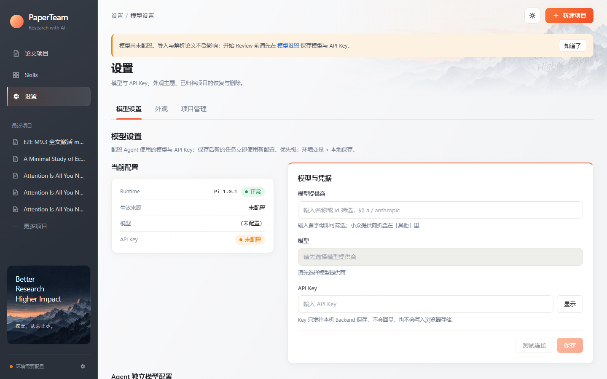
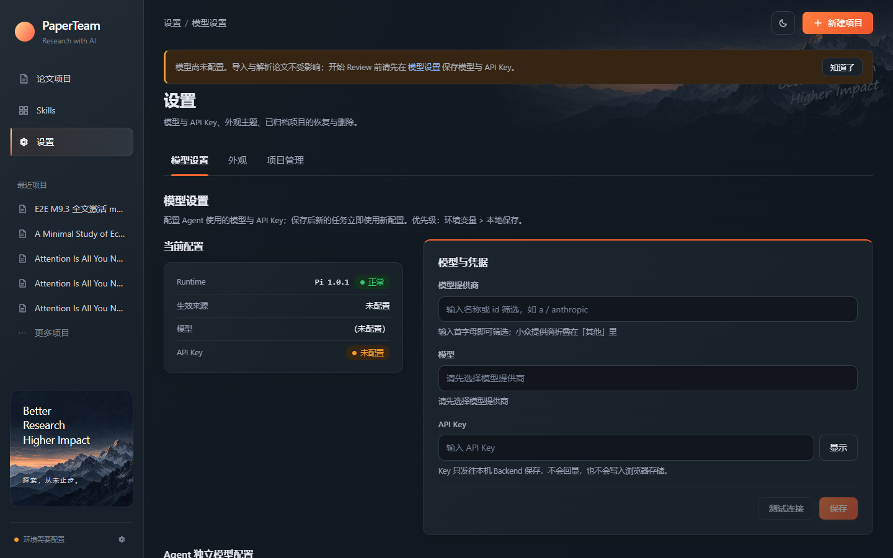
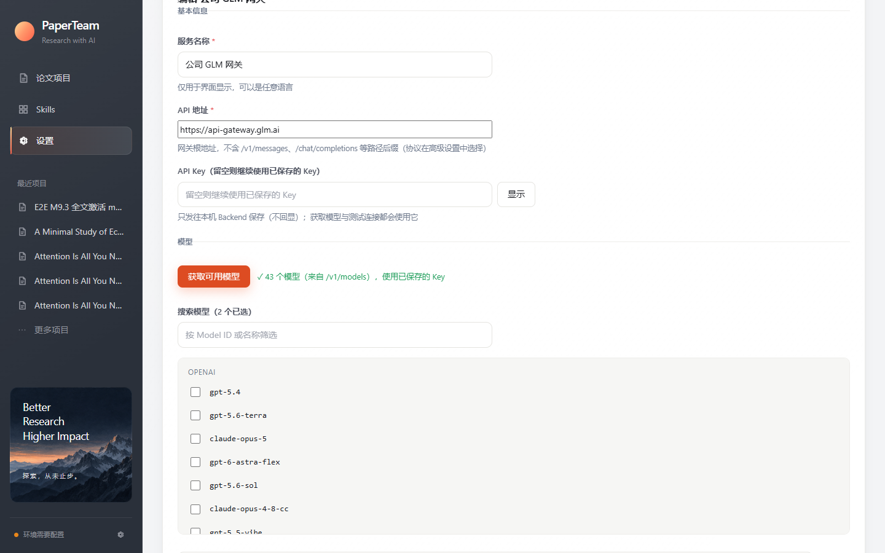
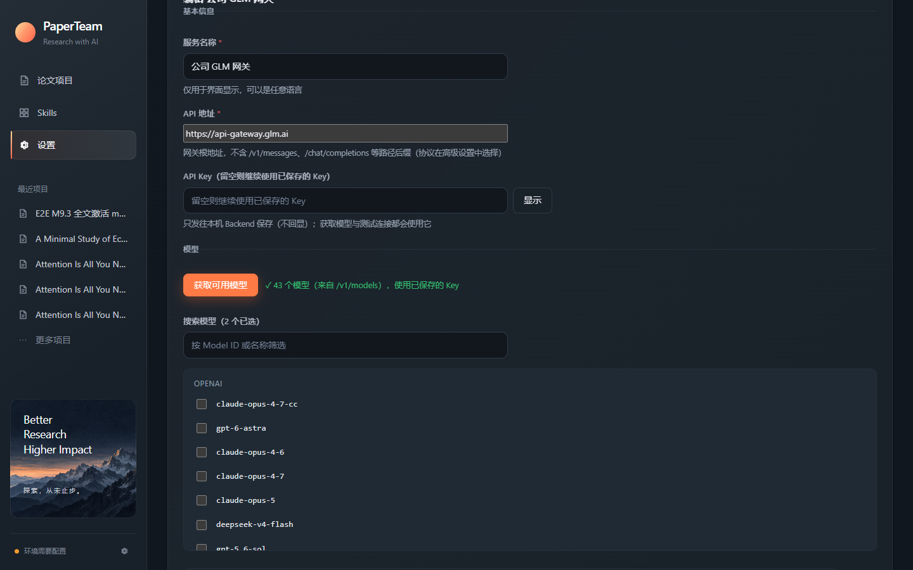

# M13.4 — Custom Provider UX Redesign & Automatic Model Discovery 验收报告

- 日期：2026-10-09
- 分支：main（直接实施，按任务要求）
- 范围：模型设置之「自定义提供商」重构 + 自动模型发现闭环（Frontend / Backend / API / Pi Runtime / 测试），不涉及论文工作流、Experiment Package、Evidence、Figure 系统
- 最终验收目标：**公司模型网关（https://api-gateway.glm.ai）经普通用户视角真实可用** ✅（见 §6）

---

## 1. 原 UI 存在的问题（重构动机）

对旧版 `CustomProviderPanel`（M4.3.7.5 时代实现）的审计结论：

1. **Provider ID 是普通用户必填项**——还带一串格式约束文案（"小写字母、数字、连字符；模型规格写作 id/model-id，保存后不可改"），普通作者根本不该面对内部标识符。
2. **API Key 被放在表单最底部**（"凭据" fieldset），而它是获取模型的前提——顺序颠倒。
3. **模型列表是一张 7 列手工技术表格**（Model ID / 显示名称 / 上下文窗口 / 最大输出 / 推理 / 图片 / 操作），每个模型都要手抄网关文档里的参数，且默认值（200000/8192）看起来像"已知事实"，实际上未经上游确认。
4. **没有任何自动发现**——公司网关明明提供 `/v1/models`，用户却要手工逐个抄 43 个模型 ID。
5. **没有测试连接**——配置对不对要保存后跑任务才知道。
6. 协议（三种 API）、认证头（Bearer vs x-api-key）、额外请求头全部平铺在首屏，普通用户第一眼看到的就是内部术语。
7. 旧表单两个并排字段（提供商 id / 显示名称）基线不齐、帮助文案与技术细节混杂；输入框无宽度约束。

## 2. CC Switch 借鉴点

参考 [cc-switch](https://github.com/farion1231/cc-switch)（文档 `docs/user-manual/zh/2-providers/2.1-add.md`）的供应商配置 UX。**只借鉴交互与信息层级，未复制任何源码**（该仓库为 Tauri/Rust/SQLite 架构，任务明确不引入；无署名义务，如后续复用具体代码需先核对许可证）：

| CC Switch 模式 | PaperTeam 落地 |
|---|---|
| 模型输入框旁的「获取模型」按钮：用已填 Key 调 OpenAI 兼容 `/v1/models`，成功后按类别分组选择 | 「获取可用模型」主按钮（醒目、带说明 tooltip）→ Backend 代发目录请求 → 按 `owned_by` 分组的复选列表 + 搜索框 + 已选计数 |
| 获取失败的错误分类：401/403 查 Key；**404/405 = 该供应商未提供 /v1/models，需手动填写**；解析失败；超时 | 同口径的错误分类文案，且 404/405 时明确「这不代表网关不可用」并直接引导手动添加 |
| 高级选项默认折叠，配置了非默认 API 格式时自动展开 | 新建默认折叠；编辑既有提供商 / 修改过协议、认证、发现路径、请求头时默认展开 |
| 模型映射表（模型 ID / 显示名称 / 上下文窗口，后两者可选） | 已选模型收进可展开详情（默认只显示 id + 未验证徽标），参数在详情里编辑 |
| 表单主操作突出、一键保存 | 保存为 primary；获取模型按钮同为 primary（向导式流程的两个关键动作） |

未借鉴：预设模板目录（CC Switch 的核心是预设，PaperTeam 自定义网关场景少而专，预设属后续可选项）、本地代理/协议转换（PaperTeam 用 Pi Runtime 原生三协议）、OAuth 设备码流程。

## 3. 新交互流程

**服务名称 → API 地址 → API Key → 获取模型 → 选择模型 → 测试连接 → 保存**

- **服务名称**（必填，任意语言，仅展示用）。Provider ID 不再要求用户填写：服务端自动生成（见 §4.1），高级设置里只读展示（新建显示"保存时自动生成"）。
- **API 地址**（必填）。placeholder `https://api.example.com`；帮助文案说明不含路径后缀、协议决定推理路径。
- **API Key**（Key 在模型区之前）。新建可直接输入；编辑不回显，留空 = 继续使用已保存 Key（帮助文案随 `authConfigured` 变化）。
- **获取可用模型**（主按钮）：成功显示"√ N 个模型（来自 /v1/models）[，使用已保存的 Key][，已截断]"；失败显示分类文案 + 详细信息 note。目录支持搜索（id/名称）、`owned_by` 分组、复选多选/取消、上游提供的上下文窗口徽标（"128k 上下文"）。
- **手动添加兜底**：Model ID 输入框 + 添加按钮（回车等价）；重复/空白拒绝并有明确文案。
- **已选模型**：折叠式详情行（id + 名称 + "未验证"徽标），展开可编辑 显示名称/上下文窗口/最大输出/推理/图片输入；编辑数值即视为已确认（徽标消失）。**刷新目录不清掉已有选择**（勾选状态由已选列表驱动）。
- **测试连接（保存前）**：选模型 → 真实最小调用（见 §5）→ 成功显示延迟，失败显示分类文案 + 可展开的脱敏详情。
- **高级设置**（`
`，默认折叠）：接口协议（含各协议推理路径说明）、认证方式（Bearer / x-api-key）、模型发现路径覆盖、额外请求头、Provider ID（只读）。
- **脏改动保护**：有未保存修改时点取消 → 行内"放弃修改 / 继续编辑"确认。
- 布局：单列为主（输入框限宽 32rem，窄屏放开），必填标记统一右缀 `*`，Label/输入/帮助文案左对齐；全部用现有 design tokens（亮/暗主题自动适配）。

截图（2026-10-09 实机，真实公司网关数据）：

| 亮色 | 暗色 |
|---|---|
|  |  |
|  |  |

表单截图要点：基本信息三字段顺序正确；"√ 43 个模型（来自 /v1/models），使用已保存的 Key"；分组目录（公司网关的 `owned_by` 实际把多数模型归到 OPENAI 组，分组被真实数据验证）；搜索框带已选计数。

## 4. 模型发现实现（本轮最高优先级）

新模块 `backend/src/settings/ModelDiscovery.ts`（纯函数 + HTTP 执行器）+ `ModelSettingsService.discoverCustomProviderModels`。

### 4.1 Provider ID 自动生成

`generateProviderId({name, baseUrl, taken})`（`CustomProviderStore.ts`）：

- 种子优先级：名称 slug（NFKD → 小写 → 非 `[a-z0-9]` 连续段折叠为单连字符，取前 32 字符）→ baseUrl 主机名 slug → `custom-provider` 兜底；
- 中文名实例："公司 GLM 网关" → `glm`（可转换片段保留）；纯中文"智谱网关" → 落主机名 `gateway-example-test`；
- 冲突自动 `-2`/`-3`… 序号（taken 同时查已存储自定义 id 与 Runtime 已注册 id，含内置/models.json），**绝不覆盖已有条目**；
- 编辑走 PUT（path === provider.id 强校验），id 永不改变；既有 `provider/model-id` 规格、Per-Agent Override、模型偏好完全兼容（存储结构只增不改）。

### 4.2 发现路径规则（发现 ≠ 推理）

按「baseUrl 路径是否以 `/v1` 结尾」推导，**与协议解耦**（这是公司网关的真实形态：推理走 Anthropic `/v1/messages`，目录却是 OpenAI 风格 `/v1/models`）：

| baseUrl 形态 | 首选 | 备选（仅 404/405 时） | 依据 |
|---|---|---|---|
| `https://api-gateway.glm.ai`（无 /v1） | `/v1/models` | `/models` | Anthropic 官方惯例 + 公司网关实测 |
| `https://api.openai.com/v1`（含 /v1） | `/models` | `/v1/models` | OpenAI 惯例（Pi 的 openai-* baseUrl 含 /v1，SDK 直接拼 `/chat/completions`） |

任何组合都拼不出 `/v1/v1/models`。用户可在高级设置用 `modelsPath` 覆盖（只影响发现，不影响推理）。

### 4.3 安全与稳健性边界（全部有测试）

- Backend 代发请求（浏览器零跨域问题）；认证头按协议选择：openai-\* 恒 `Authorization: Bearer`；anthropic-messages 按 `authHeader`（true → Bearer / false → x-api-key）。**key 只经请求头，绝不进 URL、日志、异常详情或返回值**（响应与日志均有 not-contain 断言）。
- `redirect: "manual"`：跨主机重定向一律拒绝（不转发认证头，明示"请改用最终地址"）；仅同主机 http→https 升级最多跟一跳。
- 超时 15s（AbortSignal）、响应体 5MB 上限（流式截断）、模型数 500 上限（truncated 标记）、候选路径最多 2 个、**0 次自动重试**。
- 状态码语义：401/403 → AUTH_FAILED；404/405 → 尝试备选 → 仍失败 = NOT_SUPPORTED（**明确区分"目录接口不支持"与"网关不可用"**，前端引导手动添加）；429 → RATE_LIMITED；5xx → SERVER_ERROR；非法 JSON / 非目录结构 → BAD_RESPONSE。
- 响应形态适配：`{data:[...]}`（OpenAI）/ `{models:[...]}` / 裸数组；条目取 `id`（跳过非字符串/空白/超长）、`name`/`display_name`、`owned_by`、`context_length`/`context_window`；重复 id 去重；空列表是合法结果（ok + 0 模型，前端显示空态引导）。
- 凭据优先级：请求体 apiKey > `providerId` 已保存凭据（`ModelRuntime.getAuth` 解析，含 `PAPERTEAM_PI_API_KEY` 内存覆盖层；authHeader=true 时从合成 Bearer 头取回裸 key）> 免认证尝试。**不为获取目录强迫用户重输 Key**；返回 `authSource: request/stored/none` 供前端展示。

### 4.4 元数据诚实性

公司网关目录不提供上下文窗口（43 个模型 0 个带 context_length）。落地口径：目录提供 → 数值直接采用并视为已验证（`metadataVerified: true`，持久化）；未提供 → 保守默认 200k/8192 + **UI"未验证"徽标**（不假装已知）；用户编辑数值即视为确认。`reasoning`/`image` 缺省 false（勾错会发送服务端不接受的参数，宁可保守）。

## 5. API / Runtime 接线

### 新端点（`docs/API_CONTRACT.md` 已更新）

| 端点 | 语义 |
|---|---|
| `POST /api/settings/model/custom-providers` | 新建；provider.id 可空串 → 自动生成，响应带生成结果 |
| `POST /api/settings/model/custom-providers/discover-models` | 目录发现（§4） |
| `POST /api/settings/model/custom-providers/test` | 保存前测试连接 |

既有 `PUT/DELETE .../:id`、`GET ...` 语义不变（PUT 从"新建/替换"收窄为"替换"，新建走 POST；旧客户端带 id 的 PUT 行为不变）。

### 保存前测试的技术实现

Pi 的 `prepareRequest` 对未注册 provider 直接抛 `Unknown provider`，无法用游离 Model 对象调用。落地方案：**临时注册 → 真实探测 → finally 恢复**——

1. 解析提交配置（同一套 `validateCustomProviderInput`）；测试 id = 提供的 id（编辑）或按生成规则推导（新建，确定性 → 与保存后一致）；
2. 若该 id 已有存储配置：先 `unregisterProvider`，注册新配置；否则直接注册（生成规则保证不撞内置）；
3. `completeSimple` 真实最小调用（复用 `testConnection` 抽取出的 `probeModel`：30s 超时、64 token、reasoning 档位自适应、失败分类 + 脱敏截断）；
4. `finally`：注销临时注册；编辑场景重放原存储配置（恢复失败时记录日志——`custom-providers.json` 是事实源，重启重放兜底）。

注册只存在于 Pi 内存扩展层：**不动 credential（auth.json）、不动存储文件，任何失败路径都不留半配置**（测试断言探测后 Runtime 无残留、存储无残留）。凭据：请求体 apiKey（未保存的 Key 经 `getAuth` 的 overrides 合成凭据注入，authHeader 的 Bearer 也用新 Key）> 既有 id 的已保存凭据；新建且无 Key → 明确 AUTH_FAILED 提示而非模糊失败。

### 保存后的可见性

保存 → `registerProvider` → 立即出现在 `GET /options`（provider 下拉、`source: "custom"`）与 `?provider=` 模型目录（默认模型 / Per-Agent / Vision 选择器同源）；当前生效模型属于该 provider 时自动 reconfigure；重启经 `registerStoredCustomProviders` 重放（不变）。

## 6. 真实模型发现与真实调用结果（验收核心）

环境：本机运行新代码的 Backend（`127.0.0.1:3000`）+ 作者本机已有的公司网关凭据（Claude Code 自身的 `ANTHROPIC_AUTH_TOKEN`，只经 env 内联进请求体，全程未打印、未写入任何日志/测试文件）。

| 步骤 | 结果 |
|---|---|
| 1. 无凭据探测 `GET https://api-gateway.glm.ai/v1/models` | HTTP 401 `{"error":"\"Authorization\" header is missing"}`（网关要求认证） |
| 2. 真实发现（`discover-models` + Bearer） | **ok: true，43 个真实模型**，sourcePath `/v1/models`，未截断。含 `claude-fable-5-1`、`claude-opus-5`、`glm-5.3-highspeed`、`glm-5.2`、GPT/Kimi 系列等；**0 个带上游 contextWindow**（→ UI 全部诚实标记"未验证"） |
| 3. 保存「公司 GLM 网关」（id 自动生成） | id = `glm`（"公司 GLM 网关"的可转换片段），选择 `glm-5.3-highspeed` + `claude-fable-5-1`，authConfigured: true，响应无 key 材料 |
| 4. 已保存凭据复用发现（不传 apiKey） | **ok: true，authSource: stored，43 模型**（无需重输 Key） |
| 5. 真实推理调用（已保存注册表 + 存储凭据，与 Agent 运行时同路径） | `glm/glm-5.3-highspeed` **ok: true（1803ms）**；`glm/claude-fable-5-1` **ok: true（3900ms）** |
| 6. 默认模型设置可见性 | `GET /options?provider=glm` → source: custom，两个模型可下拉选择 |

> 说明（对作者）：第 3 步按产品行为把网关 Key 存入了 PaperTeam 本机凭据库（`~/.paperteam/runtime/pi/agent/auth.json` 的 `glm` 条目）。默认模型偏好**未改动**（仍为 `zai-coding-cn/glm-5.3`）；在设置页选 `公司 GLM 网关` 的模型保存即可切换。若不想保留该凭据，设置页删除该提供商即连同清除。

> 「最小 Agent smoke」口径：第 5 步是经 Pi `completeSimple` 的真实推理调用（与 Agent 同一 runtime、同一注册表、同一凭据解析链）；完整 Agent 工作流 smoke 未在本轮跑（会触发完整论文流水线），浏览器 e2e（§7）已在 mock 网关上验证了保存 → 默认模型 → 测试连接的完整 UI 链路。

## 7. 失败回退策略

- 目录 404/405 → NOT_SUPPORTED："这不代表网关不可用：请手动添加 Model ID"——手动添加永远可用，目录失败不阻塞接入。
- 401/403 → 提示检查 Key；超时/网络/5xx → 提示重试；跨主机重定向 → 提示改用最终地址。
- 保存前测试失败 → 分类文案 + 脱敏详情，**不产生任何半配置**（临时注册 finally 恢复）。
- 保存失败（id 冲突等）→ 表单保留全部输入，错误就地显示。
- 编辑回退：目录刷新不清已选；取消脏改动需确认；编辑不回显 Key、留空不覆盖。
- 元数据缺失 → 保守默认 + "未验证"标记，不伪造能力。

## 8. 测试与截图

| 层 | 结果 |
|---|---|
| Backend 新增（`test/settings/modelDiscovery.test.ts`，本地 mock 网关含 Anthropic SSE 最小实现） | 路径拼接 / 认证头 / 解析形态 / 去重截断 / 401/403/404→备选/404+405/429/5xx/非法 JSON/空列表/超时/响应体超限/跨主机重定向/modelsPath 覆盖 / 存储凭据复用 / key 不进响应与日志 / 保存前测试（真实 completeSimple 成功 + 失败分类 + 注册恢复）/ modelsPath·metadataVerified 持久化 / HTTP 路由 400 |
| Backend 更新（`customProviders.test.ts`） | id 缺省自动生成（slug / 中文名两路径 / 冲突序号 / 编辑保 id）、POST 新契约；既有校验/注入/重放/删除用例全保留 |
| Backend settings 套件 | 119/119（7 files） |
| Backend 全量 | 2954/2974；4 个失败为 `httpWorkflowApi` / `sseCancelSemantics` SSE 时序用例——**stash 本轮改动后在干净 main 上复跑同样失败**（本机全量并发既有 flake，非本轮引入；相关文件单独跑全绿） |
| Frontend 新增（`CustomProviderPanel.test.tsx`） | 高级折叠/展开、目录+搜索+多选+取消+刷新保留、NOT_SUPPORTED 兜底+手动添加去重、编辑凭据复用（不带 apiKey 带 providerId）、新建 create 载荷、保存错误保留、编辑回填（Key 不回显/PUT 保 id/留空不带 apiKey）、删除确认、元数据（编辑后未验证消失 + metadataVerified）、上游上下文不标未验证、回车添加、空目录态、未填地址本地拦截、测试连接失败分类+详情折叠 |
| Frontend 更新（`ModelSettingsPage.test.tsx`） | 两个自定义提供商用例按新流程重写（含目录载荷形状 / 脏取消确认 / 编辑只读 id） |
| Frontend 全量 | 308/308（32 files），typecheck 0 错 |
| Playwright e2e（`e2e/tests/custom-provider.spec.ts`，首个 HTTP 级 mock 网关） | 真实浏览器全链路：添加 → 名称/地址/Key → 获取模型（mock 校验 Bearer）→ 搜索 → 选择 → 未验证徽标 → **保存前测试连接（真实 Pi → Anthropic SSE）** → 保存（自动 id `e2e-mock-gateway`）→ 设默认模型 → 主面板测试连接 → options 核验；结束时恢复原默认模型并删除测试提供商。1/1 通过（4.9s） |
| 既有 smoke e2e | 7/7 通过（主面板回归无破坏） |
| 截图 | `docs/research/assets/m13-4-{list,form}-{light,dark}.png`（§3，真实网关数据实机截图） |

## 9. Git 与 CI

- 直接在 main 实施（按任务要求）；commit 内容：backend（发现模块 / id 生成 / 服务方法 / 路由 / 测试）、frontend（面板重构 / 类型 / hooks / CSS / 测试）、e2e（mock 网关规格）、文档（API_CONTRACT / 本报告）。
- CI：commit `cbea342` 的 **GitHub CI ✅ success** 与 **Linux Integration ✅ success**（2026-10-09 实测）。
- 完成态核验：HEAD == origin/main、working tree clean。

## 10. 未实现能力（如实声明）

1. **预设模板目录**（CC Switch 的预设体系）：未做。当前场景（公司网关/自建网关）数量少，协议默认值（anthropic-messages + Bearer）已覆盖主路径；如需可后续加少量预设。
2. **协议自动识别**：不做（任务明示不得未经测试就宣称）。协议在高级设置手选；选错时测试连接会给出真实失败分类。
3. **OpenAI Responses 协议的目录发现验证**：路径规则与实现已覆盖（`/models`），但本轮没有真实 Responses-only 网关做实机验证（mock + 单测已覆盖路径逻辑）。
4. **完整 Agent 工作流 smoke**（跑一篇论文全流程）：未执行；真实推理调用与浏览器 UI 链路已分别验证（§6/§8）。
5. **同一时刻的并发保存竞态**：沿用既有 `assertIdle`（409）语义，未新增队列。
6. 目录响应的非标准字段（定价、多模态能力标记等）未采集——只取 id/name/owned_by/context_window。
